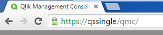
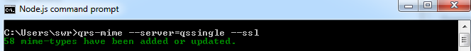

# qrs-mime

> Add mime types to the Qlik Sense repository.

[](https://github.com/stefanwalther/qrs-mime)

***

## About

The _qrs-mime_ tool is a command line tool based on node.js. It allows you to add mime-type definitions to Qlik Sense server.

This tool can be used to add the missing mime types in Qlik Sense 2.1.1 to make typical visualization extensions work again, but in general, this tool can also be used to add support for very specific Mime-types in your Qlik Sense environment.

## Table of Contents

<!-- toc -->

* [Installation](#installation)
* [Usage](#usage)
* [Command line options](#command-line-options)
* [Defining your own set of Mime-types](#defining-your-own-set-of-mime-types)
* [Troubleshooting](#troubleshooting)
* [Known Issues](#known-issues)
* [Contributing](#contributing)
* [Related Projects](#related-projects)
* [Author](#author)
* [License](#license)

_(Table of contents generated by [verb])_

<!-- tocstop -->

## Installation

1. Make sure that you have [node.js](https://nodejs.org/) installed, otherwise [install node.js](https://nodejs.org/)
2. Use [npm](https://npmjs.com) to install _qrs-sense_ globally.

```bash
npm install qrs-mime -g
```

## Usage

After installation of _qrs-mime_ using [npm](https://npmjs.com) open the [node.js](https://nodejs.org) command line and run _qrs-mime_ using one of the following options:

**Run the tool directly on Qlik Sense server** - By doing so the locally already available certificates will be used for authentication.

**Run the tool on a different machine against a Qlik Sense server** - If this is the case, you need to set up proper authentication between your machine and the server where the Qlik Sense Repository Services (QRS) is running on.

### Running qrs-mime directly on Qlik Sense server

First find out the qualified name you have used during the installation. The easiest way to achieve this is to open the "Qlik Management Console" on your server, then you'll see the qualified name in the Url:

For example:

[](#installation)

Then run the _qrs-mime_:

```bash
qrs-mime --server=qsSingle --ssl
```

That's it, you should get the following confirmation:
[](#usage)

### Running qrs-mime on a different machine / using header authentication

If you have properly set up header authentication for QRS, you should then have the following information to run qrs-mime:

* Fully qualified name or IP-address of your server (e.g. `myserver.mydomain.com`)
* Name of the virtual proxy (e.g. `hdr`)
* Whether to use SSL or not
* The user you want to map to:
  - The header key and (e.g. `hdr-usr`)
  - The header value (e.g. `mydomain.com\myUserName`)
* The user defined in your header-value should have rootAdmin permissions on QRS

Then run the following command:

```bash
qrs-mime 
    --auth=header 
    --server=myserver.mydomian.com 
    --virtual-proxy=hdr 
    --ssl 
    --header-key=hdr-usr 
    --header-value=mydomain.com\myUserName
```

_(Remove line breaks which were just added to improve readability)_

**Note:**

* Depending on the connection to the server, it can take a minute or two until the the job is done.
* Further options can be defined if necessary.

Some references to help you to set up header authentication:

* [Header authentication in Qlik Sense: Setup and configuration](https://github.com/stefanwalther/articles/tree/master/header-authentication-configuration)
* [Qlik Sense Help: Virtual Proxy](http://help.qlik.com/sense/2.1/en-US/online/Subsystems/ManagementConsole/Content/create-virtual-proxy.htm)

### Running _qrs-mime_ on a different machine / using certificates

[](#command-line-options)

If you have exported the certificates and copied to your system, you should then have the following information available to run `qrs-mime`:

* Fully qualified name or IP-address of your server (e.g. `myserver.mydomain.com`)
* Name of the virtual proxy (if needed, leave blank if you are unsure)
* Whether to use ssl (define it, if you are unsure)
* Location of the certificate file (e.g. `C:\CertStore\client.pem`)
* Location of the key file (e.g. `C:\CertStore\client_key.pem`)
* Location of the ca file (e.g. `C:\CertStore\root.pem`)
* The user you want to map to (if not defined the below values will be used)
  - The header key and (e.g. `X-Qlik-User`)
  - The header value (e.g. `UserDirectory=Internal;UserId=sa_repository`)

```bash
qrs-mime
    --auth=certificates
    --server=myserver.mydomain.com
    --ssl
    --cert="C:\CertStore\client.pem"
    --key="C:\CertStore\client_key.pem"
    --ca="C:\CertStore\root.pem
```

_(Remove line breaks which were just added to improve readability)_

**Note:**

* Depending on the connection to the server, it can take a minute or two until the the job is done.
* Further options can be defined if necessary.

Some references to help to set up certificate based authentication:

* [Authenticating with Certificates: Setup and Configuration](https://github.com/stefanwalther/articles/tree/master/authentication-certificates)
* [Qlik Sense Developer Help: Exporting certificates](http://help.qlik.com/sense/2.1/en-US/online/Subsystems/ManagementConsole/Content/export-certificates.htm) (Make sure you use the platform independent format)
* [Qlik Sense Developer Help: Connecting using certificates](http://help.qlik.com/sense/2.1/en-us/developer/Subsystems/RepositoryServiceAPI/Content/RepositoryServiceAPI/RepositoryServiceAPI-Example-Connect-cURL-Certificates.htm)

## Command line options

* **`--help`** (alias `-h`) - Display the usage guide.
* **`--debug`** (alias `-d`) - Return debug info.
* **`--server`** - Server where the QRS is running.
* **`--virtual-proxy`** - Name of the virtual proxy.
* **`--auth`** (alias `-d`)
Authentication method, can be either "certificates" (c) or "header" (h).
Defaults to "certificates".
* **`--port`** (alias `-p`) Port to be used.
If you want to use the default port, use 0 or leave blank.
In case of using certificates leave either blank or use 4242.
* **`--ssl`** - Whether to use SSL (defaults to false). If `--ssl` is not set, SSL is not used.
If SSL is desired, define --ssl, otherwise omit this option.
* **`--header-key`** - Header key, typically used when using header authentication, in case of using certificates it defaults `X-Qlik-User`
* **`--header-value`** - Header value, typically used when using header authentication, in case of using certificates, it defaults to `UserDirectory=Internal;UserId=sa_repository`
* **`--cert`** - Path to the certificate file, typically `client.pem`
* **`--key`** - Path to the key file, typically `client_key.pem`
* **`--ca`** - Path to the ca file, typically `root.pem`
* **`--passphrase`** - (TBD, not clear if needed at all)
* **`--file`** - Path to the file containing the definition of mime-types, by default the file you can find in this repository under `./config/mime-types.txt` will be taken.

## Defining your own set of Mime-types

When running _qrs-mime_ the default list of added or updated Mime-Types is defined in the file `./config/mime-types.txt`

You can either modify this file to meet your custom needs or point to your very own definition of Mime-types by using the parameter `--file`

Each line of such a file defines a Mime-type to add, e.g.:

```bash
md;text/x-markdown;;false
```

In every line four settings need to be made

1. **File-extension** (`md` in the example above)
2. The official **Mime-type** (`text/x-markdown` in the example above)
3. **Additional headers** (left blank in the example above; leave blank if not 100% sure how to use that)
4. Whether the given Mime-Type is **binary** or not (`false` in the example above)

## Troubleshooting

Some recommendations if _qrs-mime_ does not work:

* Make sure that you can reach the server. Use ping `<servername>` to see if you can ping it
* Ensure that no firewall is preventing communication over port 4242 (certificates) or 80/443.
* Running the tool can take a minute or two, please be patient and wait for the result.
* If an exception is thrown you will see a message that a log file has been created in your personal temporary folder.

**Update to a newer version of _qrs-mime_**

```bash
npm cache clean
npm update qrs-mime -g
```

## Known Issues

* None, so far

## Contributing

Pull requests and stars are always welcome. For bugs and feature requests, [please create an issue](https://github.com/stefanwalther/qrs-mime/issues).
The process for contributing is outlined below:

1. Create a fork of the project
2. Work on whatever bug or feature you wish
3. Create a pull request (PR)

It cannot be guaranteed that all PRs will be merged, but they will be evaluated and commented at least.

## Related Projects

_qrs-mime_ uses [qrs](https://github.com/stefanwalther/qrs), which is a a node.js library you can use to communicate with the QRS API.

## Author

**Stefan Walther**

+ [qliksite.io](http://qliksite.io)
* [twitter/waltherstefan](http://twitter.com/waltherstefan)
* [github.com/stefanwalther](http://github.com/stefanwalther)

## License

Released under the MIT license.

***

_This file was generated by [verb-cli](https://github.com/assemble/verb-cli) on November 03, 2015._